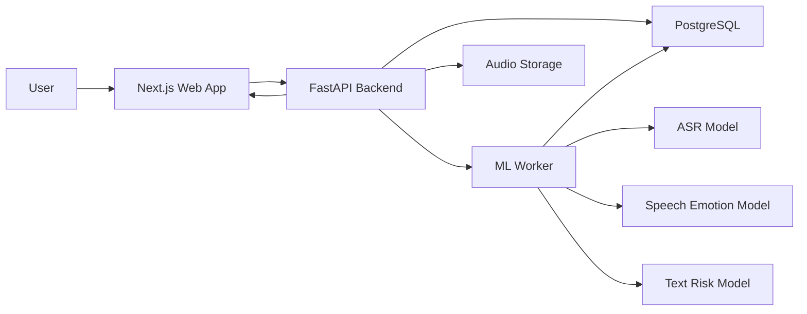
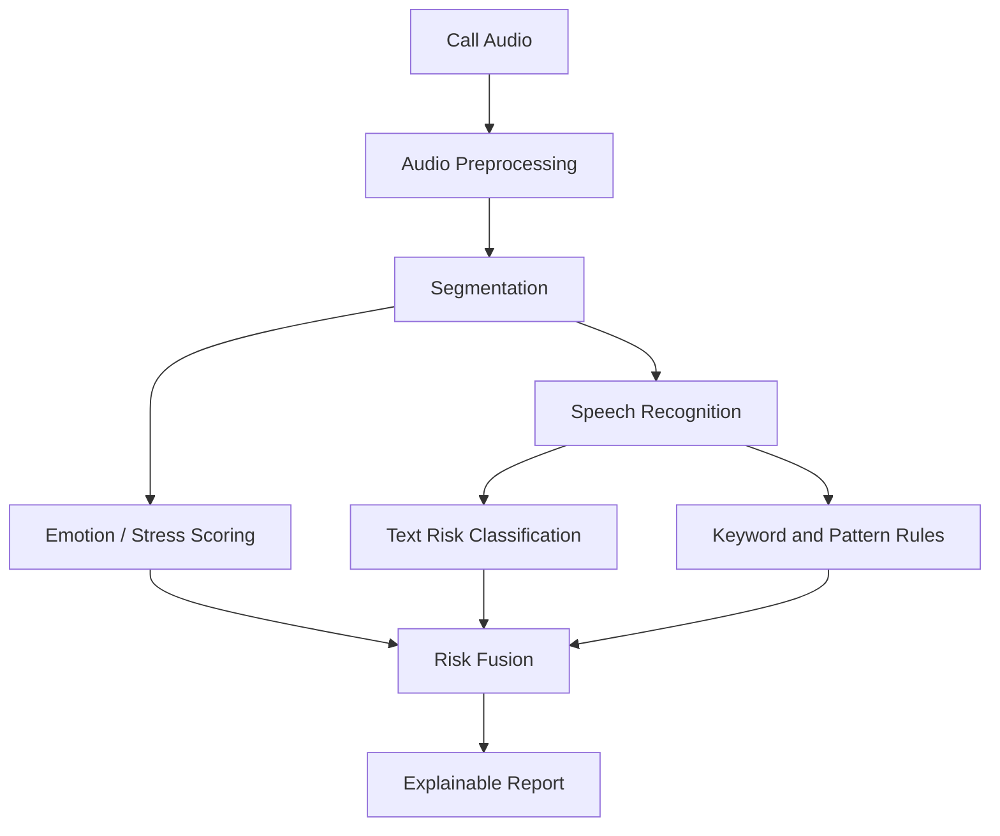

# System Architecture

## Services



## Analysis Pipeline



## Current API Surface

```text
GET  /health
GET  /api/model/audio/status
GET  /api/model/asr/status
GET  /api/model/text/status
GET  /api/model/fusion/status
POST /api/analyze/text
POST /api/analyze/audio
POST /api/transcribe/audio
POST /api/analyze/call
```

`/api/analyze/call` is the main product endpoint. It accepts multipart form data:

```text
file: optional audio file
transcript: optional call text
```

The current text-risk policy is:

```text
text model available: 80% TF-IDF text model + 20% keyword rules
text model missing: 100% keyword rules
```

The product uses CallGuard CAEF rather than a fixed production weight:

```text
audio only: 100% audio score
text only: 100% text score
audio + text: confidence-aware adaptive weights
```

CAEF learns component reliability and a text-confidence gate from a disjoint
validation split. Fixed 65/35 fusion is retained only as an experiment baseline.

If no manual transcript is provided, the backend generates an ASR transcript and
passes it through the same text-risk path before fusion.

## Current ASR Layer

The local ASR layer uses `faster-whisper-base` on CPU with int8 inference. The
model files are stored at:

```text
ml/models/asr/faster-whisper-base
```

When `/api/analyze/call` receives an audio file without a manual transcript, it
automatically transcribes the audio, analyzes the transcript with text rules, and
then fuses the ASR text score with the audio baseline score.

`faster-whisper-tiny` remains available at `ml/models/asr/faster-whisper-tiny` as
a lightweight fallback. The base model is the default because it gives more
usable Mandarin transcriptions while still being small enough for a local demo.

## Current Text-Risk Layer

The text-risk layer uses a TF-IDF character n-gram Logistic Regression model
trained on ASR transcripts generated from TeleAntiFraud audio. The exported model
is stored at:

```text
ml/models/text_baseline/model.joblib
```

For product explainability, the backend returns both keyword-rule hits and
positive model evidence terms. This keeps the demo understandable while still
using a learned machine learning model.

## Product-Grade Requirements

- The backend should use asynchronous analysis tasks for long audio files.
- The frontend should show progress states instead of blocking the user.
- Raw audio should remain local during coursework demos unless explicit consent is given.
- Every risk score should include visible reasons.
